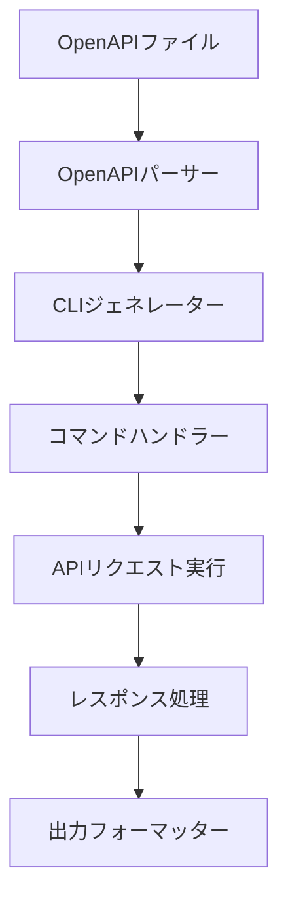
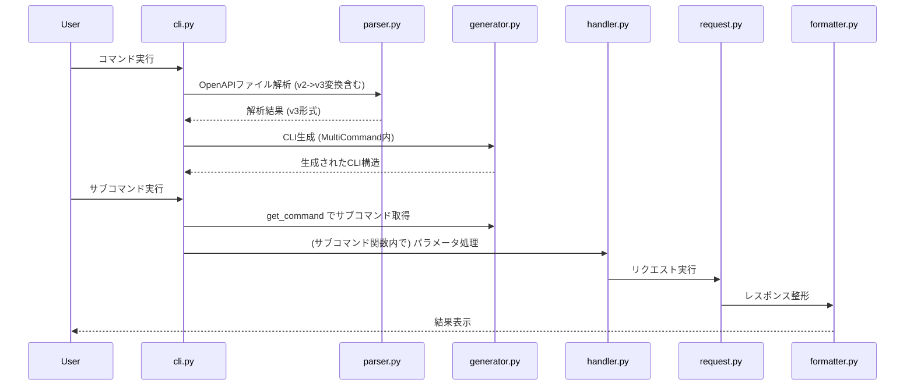

# システムパターン: clify

## システムアーキテクチャ

## 主要コンポーネント

1. **OpenAPI パーサー** (parser.py)

   - OpenAPI 仕様ファイル（JSON/YAML）を解析
   - API エンドポイント、メソッド、パラメータ情報を抽出
   - スキーマ情報を取得してバリデーションに使用
   - ローカルファイルと URL の両方をサポート
   - **OpenAPI 2.0 仕様を検出し、内部的に 3.x 形式に変換する機能を追加**

2. **CLI ジェネレーター** (generator.py)

- Click を使用して CLI コマンド構造を動的に生成
- エンドポイントごとにサブコマンドを作成
- パラメータに応じたオプションを設定
- コマンド名の自動生成（operationId またはパス/メソッドから）

3. **コマンドハンドラー** (handler.py)

   - ユーザー入力を処理
   - パラメータのバリデーション
   - API リクエストの構築
   - パスパラメータ、クエリパラメータ、ヘッダーの処理

4. **API リクエスト実行** (request.py)

   - HTTP リクエストの実行
   - 認証情報の管理
   - タイムアウト、リトライなどの処理
   - エラーハンドリング

5. **レスポンス処理** (request.py)

   - ステータスコードの確認
   - エラーハンドリング
   - レスポンスデータの解析

6. **出力フォーマッター** (formatter.py)

   - JSON/YAML/テーブル形式などでの出力
   - 色付け、整形などの表示調整
   - 出力フィルタリングオプション

7. **CLI エントリーポイント** (cli.py)
   - **`click.MultiCommand` を継承した `DynamicCLI` クラスとして実装**
   - コマンド実行時に OpenAPI ファイルを解析し、動的にサブコマンドをロード
   - グローバルオプション (サーバー URL など) を受け取り、`ctx.obj` に設定

## 設計パターン

1. **ファクトリーパターン**

   - OpenAPI 仕様に基づいてコマンドオブジェクトを生成
   - CLIGenerator.generate()メソッドがファクトリーとして機能

2. **コマンドパターン**

   - 各 API エンドポイントに対応するコマンドオブジェクトを作成
   - Click のコマンドグループとコマンド関数を使用

3. **アダプターパターン**

   - OpenAPI 仕様と Click コマンド間の変換
   - パラメータ名の変換（camelCase からケバブケースへ）

4. **ストラテジーパターン**

   - 異なる出力フォーマット方法を切り替え可能に
   - ResponseFormatter クラスでフォーマット方法を選択

5. **依存性注入パターン**
   - コンポーネント間の依存関係を明示的に注入
   - テスト時にモックオブジェクトを注入可能

## コンポーネント関係

- **疎結合設計**: 各コンポーネントは明確に分離され、テスト可能
- **拡張性**: 新しい出力フォーマットや認証方法を追加可能
- **設定駆動**: 環境変数やコンフィグファイルで動作をカスタマイズ可能

## 実装の詳細

### コマンド生成プロセス

1. OpenAPI ファイルを読み込み、解析する
2. API エンドポイント情報を抽出する
3. ルートコマンドグループを作成する
4. 認証オプションを追加する
5. 各エンドポイントに対応するサブコマンドを生成する
6. パラメータに応じたオプションを追加する
7. 生成された CLI を実行する

### コマンド実行フロー

## 現在の課題

1. **(解決済み) コマンド実行の問題**

   - `click.MultiCommand` の導入により解決

2. **OpenAPI 2.0 サポートの網羅性**

   - 現在の実装は基本的な変換のみ。複雑な仕様では問題が発生する可能性あり。

3. **API サーバー依存**
   - `clify` の動作確認には、有効な OpenAPI 仕様と稼働中の API サーバーが必要。
